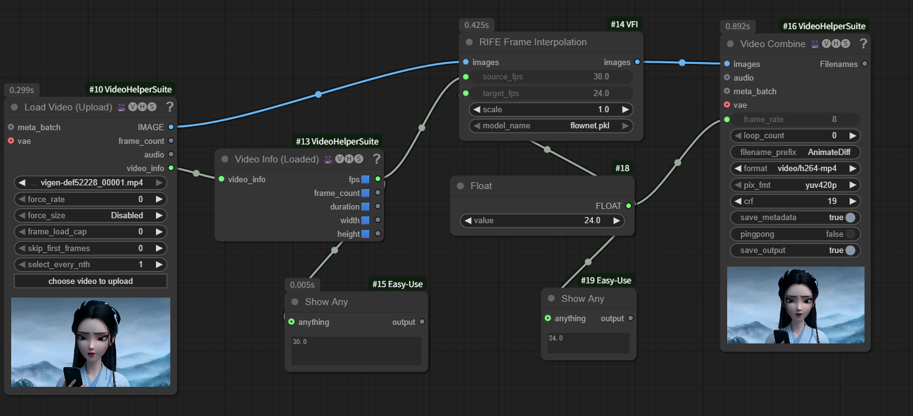

# ComfyUI-VFI

Video Frame Interpolation nodes for ComfyUI using RIFE (Real-Time Intermediate Flow Estimation).



## Features

- High-quality frame interpolation using RIFE
- Convert between different frame rates (e.g., 30fps to 60fps)
- Adjustable processing scale for performance/quality trade-off
- Model caching for efficient processing
- Progress tracking in ComfyUI

## Installation

- Clone this repository into your ComfyUI custom_nodes directory:

```bash
cd ComfyUI/custom_nodes
git clone https://github.com/your-username/ComfyUI-VFI.git
```

- Install required dependencies:

```bash
cd ComfyUI-VFI
pip install -r requirements.txt
```

- The RIFE model will be automatically downloaded on first use
  - Alternatively, you can manually place `flownet.pkl` in:
    - `ComfyUI-VFI/rife/train_log/`
    - Or `ComfyUI/models/rife/`

## Usage

The node will appear in the "image/animation" category as "RIFE Frame Interpolation".

### Inputs

- **images**: Image sequence tensor [N, H, W, C]
- **source_fps**: Original frame rate (default: 30.0)
- **target_fps**: Desired frame rate (default: 60.0)
- **scale**: Processing scale factor (default: 1.0)
  - Lower values (0.25-0.5) for faster processing
  - Higher values (1.0-4.0) for better quality

### Output

- **images**: Interpolated image sequence tensor

## Example Workflow

1. Load video frames using a video loader node
2. Connect to RIFE Frame Interpolation node
3. Set source and target FPS
4. Connect output to video encoder or preview

## Model Download

The RIFE model (`flownet.pkl`) can be downloaded from the official RIFE repository.
